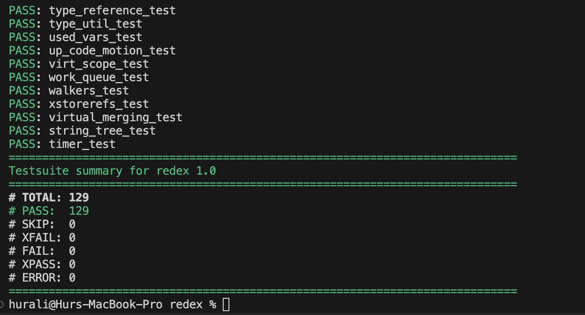
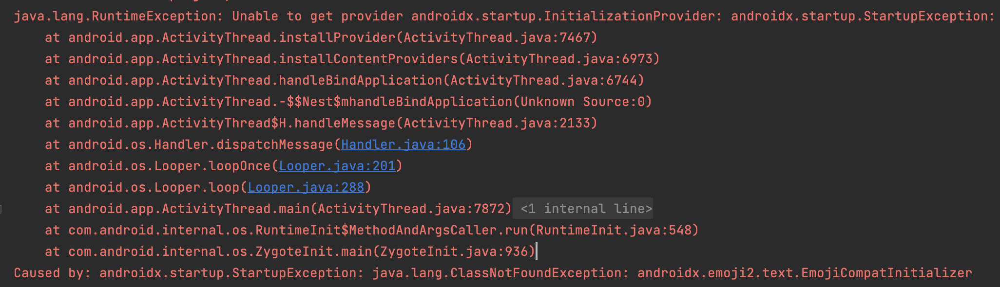
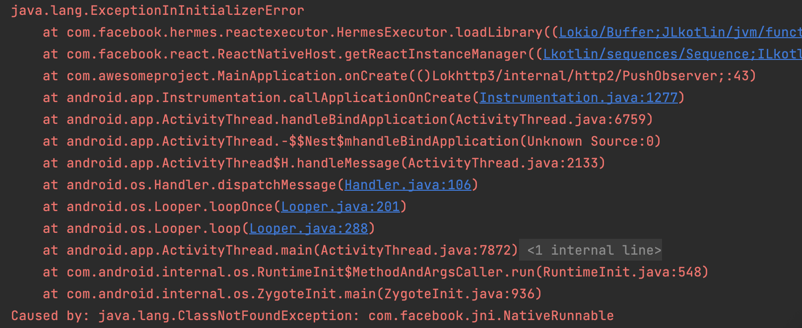
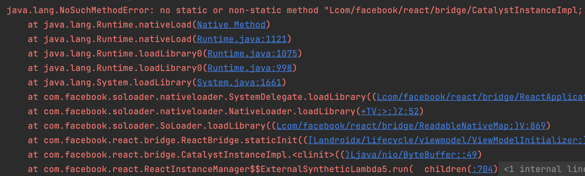
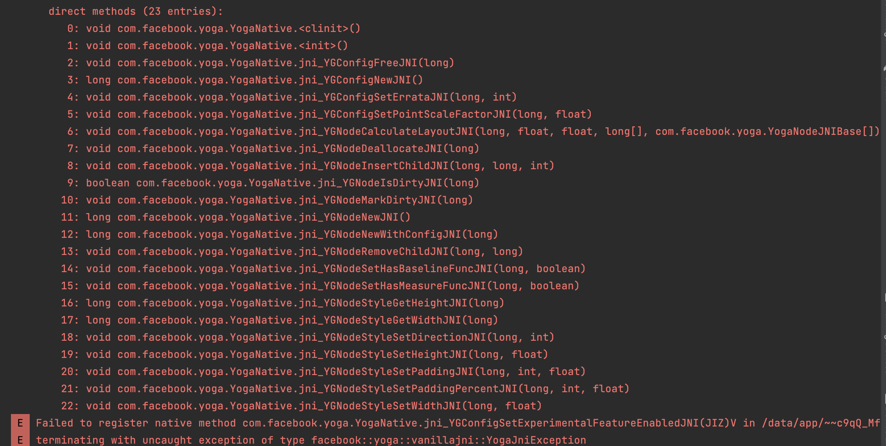
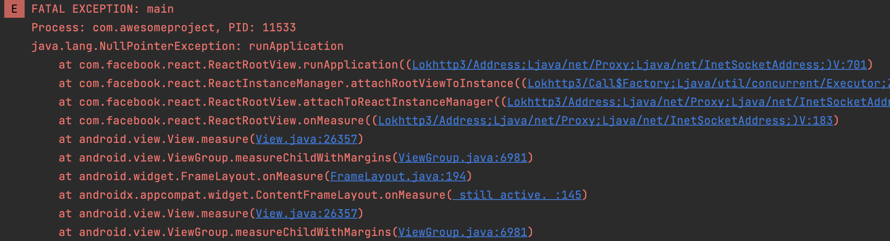
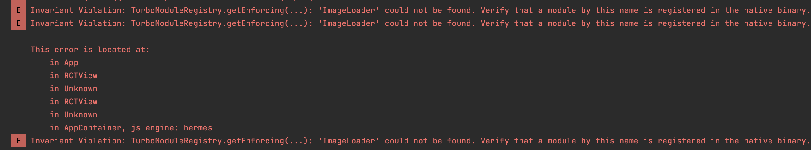
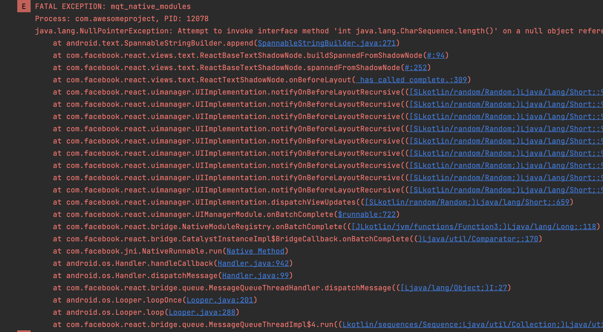
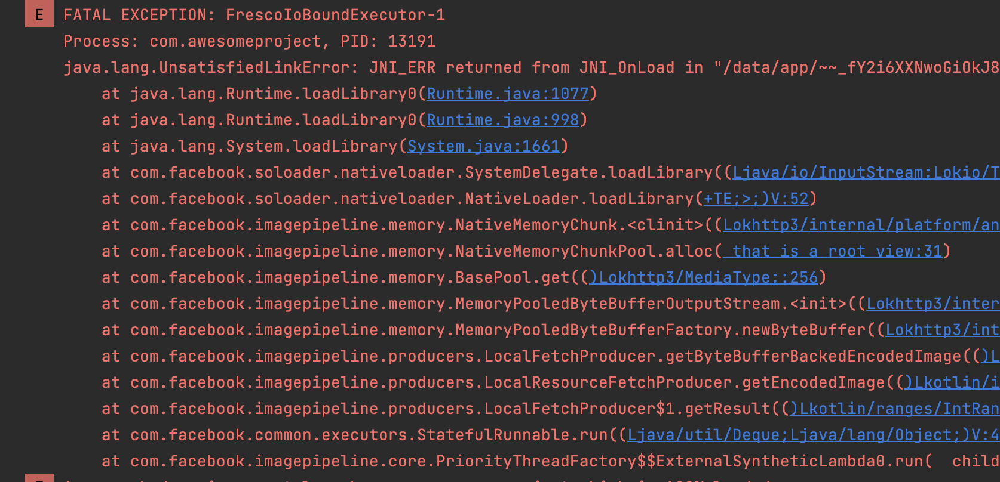
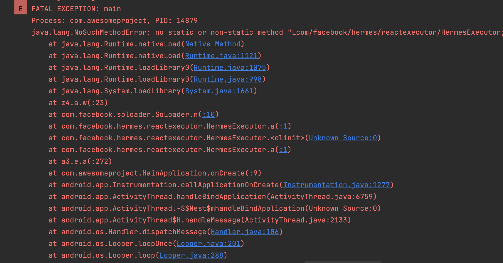

## Getting Started

This is a quick guide to get you started with ReDex. Here you'll find the steps to setup, build and run ReDex, as well as how it can be used with ProGuard and without ProGuard. We will also see a comparison of these combinations.

<br/>

>Note: You can find the installation / setup steps in ReDex docs as well. However, I faced some errors and in this guide I have mentioned the steps that worked.

<br/>

#### Installation/ Setup ReDex:

Folowing are the steps I followed to install ReDex on my macOS machine:

- Add the following to `.zprofile` or `.zshrc`

```bash
export CPATH=/opt/homebrew/include
export LIBRARY_PATH=/opt/homebrew/lib
```

- Clone the git repository of [redex](https://github.com/facebook/redex) and then run the following command from redex root:

```bash
autoreconf -ivf && ./configure --with-boost-libdir=/opt/homebrew/lib/ && make
```

- Once that's done, run the following:

```bash
sudo make install
```

- Add to .zprofile to make **dx** available in terminal. Change `hurali` to your username.

```bash
export PATH=$PATH:/Users/hurali/Library/Android/sdk/build-tools/30.0.0
```

- Then execute the test to make sure your setup is correct:

```bash
make -j4 check
```
- You should get the following output:



Now, we have everything setup, let's move on to setup our react-native app.

#### Setup React Native App:

- Create a react-native app from react-native CLI:

```bash
npx react-native@latest init AwesomeProject
```

- Once that's done, run the app to make sure everything is working fine:

```bash
yarn android
```

- Only Required if you're on macOS:
  - Now, to make our APK work with ReDex, we need to disable the resource optimizations. The error can be read [here](https://github.com/facebook/redex/issues/831).
  - One solution is to be on a Volume which is case-sensitive and macOS is case-insensitive. I have tried creating a case-sensitive volume and ran redex from there but it didn’t work either: https://www.geekyhacker.com/fix-case-sensitive-paths-on-a-case-insensitive-filesystem-on-macos/ 
  - Simplest solution is to open the `android/gradle.properties` file and add the following line:
  
```properties
android.enableResourceOptimizations=false
```

- Now, generate a release APK. You can use the `debug.keystore` to sign the release APK.

```bash
cd android && ./gradlew assembleRelease
```

<hr/>

#### Using ReDex:

We need following things to use ReDex:
- APK file
  - Paste the APK file we generated from above step in the path: `testing-apk/rn-app.apk`
- ProGuard rules file
  - Let's create a dummy ProGuard rules file in the path: `config/proguard-rules.pro` and add a dummy rule to keep a class:

```proguard
-keep class com.facebook.redex.** { *; }
```

- ReDex config
  - We already have it in the path: `config/default.config`
- Keystore file and details
  - Paste the `debug.keystore` file in the path: `config/debug.keystore`
  - Key alias: `androiddebugkey`
  - Key password: `android`

<hr/>

#### How To get metrics:
- Open the app in Android Studio and click on **Build -> Analyze APK**. This will open a window where you can see the APK size and download size.
- We will refer to this step for each performance improvement we want to test.

#### Running ReDex:

Now we have everything setup, so let's run ReDex and see how it works. We will run the following command from the ReDex root:

```bash
python3 ./redex.py --proguard-config config/proguard-rules.pro -c config/default.config ./testing-apk/rn-app.apk -o ./output.apk --always-clean-up  --sign -s config/debug.keystore -a androiddebugkey -p android
```

Once the command is executed, we will see a new APK generated in the path: `./output.apk`. Let's first install this APK and launch it to see if it's not crashing. You can use the following command to install the APK:

```bash
adb install ./output.apk
```

Uh oh it's crashing with the following error, you can see the error in Android Studio's Logcat:



Analysing this error, we see that ReDex has stripped out the `EmojiCompatInitializer` class. We will need to add a rule to keep this class in the ProGuard rules file. We can remove the previously added dummy rule and add the following rule:

```proguard
-keep class androidx.emoji2.text.EmojiCompatInitializer {*;}
```

Let's re-run ReDex, install the APK and launch it.

This time we get another error:



Analysing this error, we see that ReDex has stripped out the `JNI` classes. We will need to add a rule to keep these classes in the ProGuard rules file.

```proguard
-keep class com.facebook.jni.** { *; }
```

Let's re-run ReDex, install the APK and launch it.

This time we get another error:



If we look closely at the error, we see that static methods in class `com.facebook.react.bridge.CatalystInstanceImpl` have been stripped out. We will need to add a rule to leave this class instact in the ProGuard rules file.

```proguard
-keep,includedescriptorclasses class com.facebook.react.bridge.** { *; }
```

Let's re-run ReDex, install the APK and launch it.

This time we get another error:



It seems that ReDex has stripped out the `Yoga` classes. We will need to add a rule to keep these classes in the ProGuard rules file.

```proguard
-keep class com.facebook.yoga.** { *; }
```

Let's re-run ReDex, install the APK and launch it.

This time we get another error:



So this one's a bit tricky as we don't directly know which class or method from what class is missing. If we see in the codebase of React Native in `ReactRootView.java` there's `catalystInstance.getJSModule(AppRegistry.class).runApplication(jsAppModuleName, appParams)` being invoked and since we get a null pointer exception, we can assume that `catalystInstance.getJSModule(AppRegistry.class)` is returning null. So we will need to add a rule to keep every class that implements `JavaScriptModule` interface.

```proguard
-keep class * implements com.facebook.react.bridge.JavaScriptModule { *; }
```

Let's re-run ReDex, install the APK and launch it.

This time we get another error:



Analysing this error we see that for some reason React can't find native modules. By the looks of it, seems that ReDex has stripped out the `NativeModule` classes. We will need to add a rule to keep these classes in the ProGuard rules file.

```proguard
-keep class * implements com.facebook.react.bridge.NativeModule { *; }
```

Let's re-run ReDex, install the APK and launch it.

This time we get another error:



Okay so looks like the text classes in `com.facebook.react.views.text` have been stripped out. We will need to add a rule to keep these classes in the ProGuard rules file.

```proguard
-keep class com.facebook.react.views.text.** { *; }
```

Let's re-run ReDex, install the APK and launch it.

This time we get another error:



Alirght, so now we see that classes inside `com.facebook.imagepipeline` have been stripped out. We will need to add a rule to keep these classes in the ProGuard rules file.

```proguard
-keep class com.facebook.imagepipeline.** { *; }
```

Let's re-run ReDex, install the APK and launch it. This time we got the app running successfully. :tada:

Now, we will open the APK in Android Studio and check the metrics in the APK Analyzer. First we will measure the baseline APK and then the APK generated by ReDex.

##### Baseline APK: (testing-apk/rn-app.apk)

APK Size MB | Download Size MB
-- | -- 
20.1 | 19.6

##### ReDex Optimized APK: (./output.apk)

APK Size MB | Download Size MB
-- | -- 
18.5 | 18

We see that we have reduced the APK size by 1.6 MB and download size by 1.6 MB. This is a good improvement. Let's see if we can improve it further. We can also try with `aggressive.config` file provided by ReDex.

Run the following command to generate the APK using `aggressive.config` file:

```bash
python3 ./redex.py --proguard-config config/proguard-rules.pro -c config/aggressive.config ./testing-apk/rn-app.apk -o ./output.apk --always-clean-up  --sign -s config/debug.keystore -a androiddebugkey -p android
```
Let's install the APK to verify if it's working fine. We didn't get any error so let's proceed.

Now we will open the APK in Android Studio and check the metrics in the APK Analyzer.

APK Size MB | Download Size MB
-- | -- 
18.2 | 17.8

We have further reduced the APK size by 0.3 MB and download size by 0.2 MB. This is a good improvement. We can also try by adding different passes in the config file and see if we get any better results.

<hr />

As of yet, we have experimented on an APK which had ProGuard disabled as default. Now we will first enable ProGuard, generate a release APK and then try to use it with ReDex.

Let's enable ProGuard in our React Native app. To do this, we will need to add the following lines in the `android/app/build.gradle` file:

```groovy
buildTypes {
    release {
        minifyEnabled true
        shrinkResources true
        proguardFiles getDefaultProguardFile("proguard-android-optimize.txt"), "proguard-rules.pro"
    }
}
```

Also note that we are using optimized default ProGuard rules file. This is automatically generated by Android build system. You can find it in the path: `android/app/build/intermediates/default_proguard_files/global/proguard-android-optimize.txt-8.1.1`

Now generate the APK and then open it in the APK Analyzer. You will see that the APK size and download size has reduced. This will be our baseline APK and we will use ReDex on this APK to further reduce it's size.

APK Size MB | Download Size MB
-- | -- 
17.8 | 17.4

Now let's use ReDex to optimize the APK size further. We will use the default config file provided by ReDex. Paste the generated APK in the path: `testing-apk/rn-app-proguard.apk`

```bash
python3 ./redex.py --proguard-config config/proguard-rules.pro -c config/default.config ./testing-apk/rn-app-proguard.apk -o ./output.apk --always-clean-up  --sign -s config/debug.keystore -a androiddebugkey -p android
```

Let's install the APK to verify if it's working fine. We get the following error:




We see that there's some methods being removed in the hermes library. In the trace, we also see that the native c++ functions are having some troubles in execution. We can try adding the following ProGuard rule to see if it fixes the issue:

```proguard
-keepclassmembers,includedescriptorclasses class * { native <methods>; }
```

Let's re-run ReDex, install the APK and launch it. We didn't get any error now, so let's proceed and open the generated APK in the APK Analyzer in Android Studio.

APK Size MB | Download Size MB
-- | -- 
17.8 | 17.3

Comparing it with our baseline that has ProGuard enabled already, we get only 0.1 MB reduction in Download Size. As ReDex optimizes the Dex files and in this case, we have enabled ProGuard which optimizes before the Dex files are generated. So here in my observation, ReDex is not able to optimize that much. Also, we are just testing on a bare react native app, maybe in a real world app, we can get different results.

We can try with different passes in ReDex config file and see if we get any better results. For some passes that I tried, ReDex was unable to build the APK. I also tried with aggressive config but ReDex was unable to build the APK and I couldn't comprehend the error.

<hr />

- You can find the APKs used in this guide in the path: `testing-apk/`
- You can find the ProGuard rules, debug keystore and config files used in this guide in the path: `config/`

<hr />

In my opinion, ReDex is a good tool to optimize the APK size and download size. However, it's not a silver bullet and it's not a one click solution. It requires a lot of trial and error to get it working.

Ideally, an App should have ProGuard enabled first to get the most out of it and then ReDex can be used as part of CI to further optimize the APK size. Since ReDex can have issues running on macOS machine, it's better suited to be run on Linux environment, which we can get in CI enviornments easily, like GitHub Actions, etc. But first, you'll have to make ReDex working locally and then on CI.

#### TroubleShooting:

- If you get IRTypeChecker related issue you can try adding this to the command you’re running  `-J ir_type_checker.run_on_input=true`   [Github Issue](https://github.com/facebook/redex/issues/808#issuecomment-1625633571)
- If you’re getting Inconsistency found in dex code related issue, you can try adding this to the command you’re running  `-j ~/Library/Android/sdk/platforms/android-30/android.jar` [Github Issue](https://github.com/facebook/redex/issues/586#issuecomment-782229703)

Your final command may look like this with these steps:

```bash
python3 ./redex.py --proguard-config config/proguard-rules.pro -c config/default.config ./path_to_your.apk -o ./output.apk --always-clean-up -J ir_type_checker.run_on_input=true -j ~/Library/Android/sdk/platforms/android-30/android.jar --sign -s config/debug.keystore -a androiddebugkey -p android
```